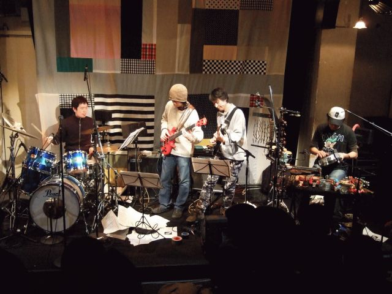
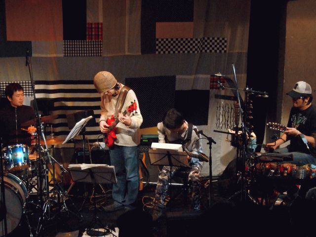
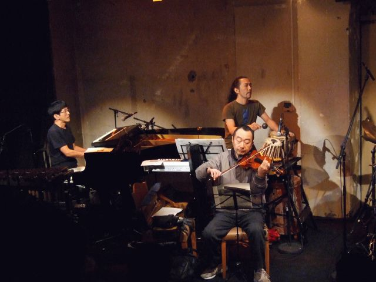

シアターイワトは神楽坂を上りきった辺りに有る小劇場みたいなスペース。飯田橋の逆の出口から歩いてきたら、あまりにも寒くて鼻水出ました。中は真横に広いステージと真横に広い客席で、メンバーの皆さんが横一列に並ぶという珍しい状態になってました。このスペースでPA大丈夫かなぁ？と思ったんですけど、最後尾で聴いてたら意外と良くってビックリ（中音はわかりませんけど）
ちなみに「ビールとか飲みたい人は隣のカクヤスで買ってきてください」との事。イイんだ。

最初はなんだかインプロ。板倉さんの低音ゴリゴリのギターにメンバーが乗ったり乗らなかったり、こーゆーインプロだとオイラーさんのドラムが結構イイ感じに聴こえます。戦うよーなインプロともセッションのよーなインプロともちょっと違ってて面白いなぁ。そしてそのまま「PERU～8687」へ。
「SALON」でフツーにお客さんとして来てた美潮さんがボイスで参加。コレのスキャットってUrszula Dudziak (Michal Urbaniakの嫁)っぽいよなぁとか毎回思います。

「EBRIO」では福岡ユタカさんが来てなかったので（来てない方が珍しいってのなんだか）珍しくメンバーだけでの演奏。後半のネコさんのバイオリンが凄い。
そこからまたインプロ（温まって来たせいか最初のインプロより面白かった、インプロやっててもmeckenのベースの音にKILLING TIMEを感じます）
んで、そこから「Limbo Dance」最後は「Blivits～BOB」で締め。やっぱし「BOB」の後半板倉さんが立ち上がる所では「をぉぉぉぉぉぉ」とか思ってしまいます。板倉信者なモノで・・・スイマセン。

アンコールでは板倉さんが「折角来てるので～」とまた美潮さんを呼んで「ブンガワン・ソロ」何度か聴いてますけどコレってインドネシアの曲なんですよね？不思議な曲だなぁとか毎回思ってます。
ちなみに美潮さん、斎藤ネコさんよりもキリタイの出席率高いようで・・・数えてないけど確かにそうだよなぁ。

最後の最後で「日没」清水さんのシンセがピョーとか言ってましたけど、、、、やっぱしコレ名曲だよなぁ。ほんとこんなに映像が浮かんでくる曲も無いもんだと思います。

なんかこー去年は(KILLING TIMEにしては)驚異的なペースでライブをやってたせいか、非常にこなれてきたなぁというか。ナマモノとしてのバンドとして凄いイキイキしてるなーとか思います。ウツボさんと話してて「プログレっぽい～」とかって話をしてましたけど（そりゃ巧いとは思うけど）テクニックがどーこーって言うバンドじゃないと思います。

ちなみに次回は2/29の閏日に代官山の「晴れたら空に豆まいて」で、斎藤ネコさん欠席で高橋香織さんがゲストです。

#### 1st set

1. impro.
2. PERU
3. 8687
4. Following Evening
5. セブムチョセ
6. SANFONA
7. バカ殿 (奴隷の恩返し)
8. SALON

#### 2nd set

1. Undiu
2. Wish
3. EBRIO
4. impro.
5. Limbo Dance
6. Blivits
7. BOB

#### encore

1. ブンガワンソロ
2. 日没

- 板倉文 (guitars)
- 清水一登 (piano,keyboards,xylophone)
- 斎藤ネコ (violin)
- Ma\*To (tabla,keyboards)
- whacho (percussions)
- mecken (bass)
- オイラー小林 (drums)
- 小川美潮 (vocals on "SALON","ブンガワンソロ")

