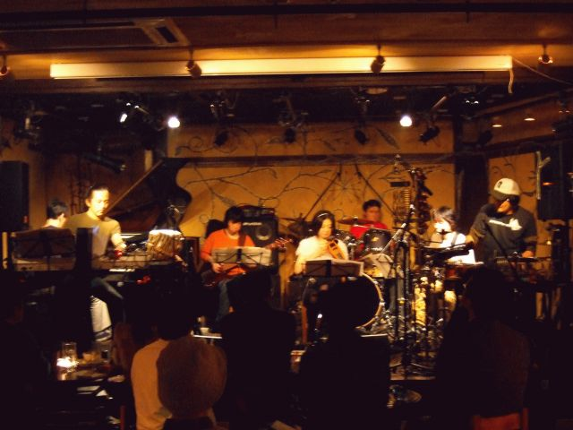

4年に一度の閏日にKILLING TIMEを見てきました。
この日は斎藤ネコさん欠席 - 高橋香織さんゲストという編成。
ちょっと事情でちょっと遅刻してしまったので、PERUの途中から観戦しました。
高橋香織さん、ずいぶん遠慮がなくなったよーで。
あとBOBでのBOBさんのバスドラがガツガツ聴こえてとても気持ちよかった。
2nd setの1曲目は初めての曲、Louis Armstrongの1920年代の曲みたい。KILLING TIMEで演奏してるからかな？とてもノスタルジックな感じの。
アンコールでは清水さんの「タスマニア」いつもは仙波清彦師匠がドラムの時に演奏してたので、青山純さんのドラムで聴くのは不思議と新鮮な感じがします。

やっぱり、いつも通りとっても面白かったんだけど・・・ちょっと客少なくね？個人的には全人類にオススメしたいバンドなのだけどー。

で、次回は 3/12(wed)に高円寺のJIROKICHIにて、去年10月以来でのフルメンバーでのライブです。
ライブはナマモノですので、お暇でもそーじゃなくても是非是非どーぞ。

-1st set:

1. かたたたき
2. PERU
3. 8687
4. Following Evening
5. Sebo Murchose
6. SANFONA
7. Vacatono (奴隷の恩返し)
8. SALON

-2nd set:

1. I'll See You in My Dreams (Louis Armstrong)
2. Undiu
3. Wish
4. EBRIO
5. impro.
6. Limbo Dance
7. Blivits
8. BOB

-encore:

1. タスマニア
2. 日没

- 板倉文 (guitars)
- 清水一登 (piano,keyboards,bass clarinet)
- Ma\*To (tabla,keyboards)
- whacho (percussions)
- mecken (bass)
- 青山純 (drums)
  ゲスト:
- 高橋香織 (violin)

