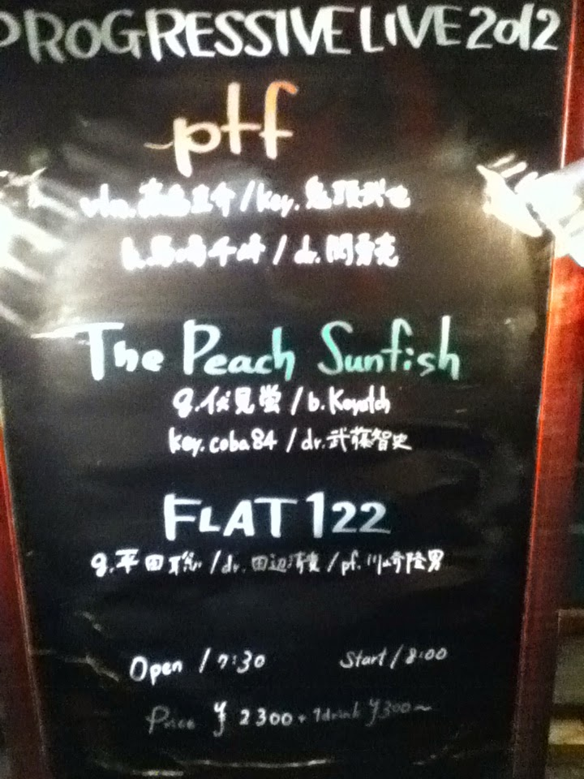

活動休止状態だったFLAT122の復活ライブを見に吉祥寺へ。今年初ライブです。

#### ptf

バイオリンフロントのプログレバンド。今回初めて見ました、普段は沼袋Sanctuary辺りでライブしてるみたいです。  
サイトで視聴した時はバイオリンのピッチが甘いのがちょっと気になったのですが、ライブだと勢い有ってあまり気にならないかも。

1曲目聴いてJean-Luc Pontyかなと思ったんですけど、それよりか単純にKBBの方が近い感じなのかなー、きっちりプログレしていて結構良かったと思います。CD-R買ってみました。

ベースの方がかなり低い位置で楽器を持っていて、基本高い位置でベースを構える事の多いプログレ界（偏見かも）ではちょっと珍しい。音の方もツマミを全開にしたよーなブリブリな音でとても好感度高かったです。

1\. Fair Wind  
2\. Nightscape  
3\. (15/8の宇宙っぽい新曲)  
4\. Firefly Effect  
5\. Chromatic Rays

高島圭介 (violin)  
馬庭千峰 (bass)  
鬼頭武也 (keyboards)  
関勇亮 (drums)

[http://ptfweb.com/](http://ptfweb.com/)

  
↓プログレらしくないベースの持ち方↓  

#### The Peach Sunfish

前見た時とベースと鍵盤の方が替わってる…かな？でも、相変わらず完成度の高いインストのギターロックです。

伏見蛍 (guitars)  
Koyatch (bass)  
武藤智史 (drums)  
coba84 (keyboards)

[http://www.myspace.com/peachsunfish  
](http://www.myspace.com/peachsunfish)

#### FLAT122

いやもう本当に久しぶりで・・・2010/05/30のプチ復活を除くと、2009/02/07以来なので大体3年ぶりくらいになるのかな？ライブ後半に行くほどにテンション上がってく感じが「あーこうだったなぁ・・・」など思い出しました。  
全体的に完成度が上がった感じががするのは、やっぱりドラムの田辺さんの演奏が良くなったからかなーとか思います。特に「記憶」の後半部分、叙情的なピアノの後ろでの即興(?)が凄く良かった。

セットリストは以下のように。これはは後から気付いたのですが、今回は全曲川崎さんの曲でした。「Spiral」の中間部のインプロとかも素晴らしかったんですけど、個人的には今回「Matsukura Snow」が、色んな表情を見せるようで凄く良かったなと…後半ちょっとゾクっと来ました。  
前回の記事にも書きましたけど、お二人のユニット(Stella Lee JonesとKTG)も好きですが、やっぱりこのバンドは他では代えがたいモノがあるなーとか。

ちなみにいつものようなギスギスしたMCが結構ウケてました。コレはもう持ちネタと言っても良いかも。平田容疑者に平田さんが似てるのは・・・確かに言われてみればそうかも、個人的にはあの写真見た時に「永川敏郎に似てる」とか思ったりしたのですが。

なんと次回のライブが決まってるようで4/14(sat)に同じく吉祥寺Silver Elephantで予定されているそうです。これは嬉しかった。

1\. Panorama  
2\. Neo Classic Dance  
3\. Matsukura snow  
4\. Gigue  
5\. Spiral  
6\. 記憶(アンコール)

川崎タカオ (keyboards)  
平田聡 (guitars)  
田辺清貴 (drums)

[http://music.geocities.jp/thewaves2005/  
](http://music.geocities.jp/thewaves2005/)

