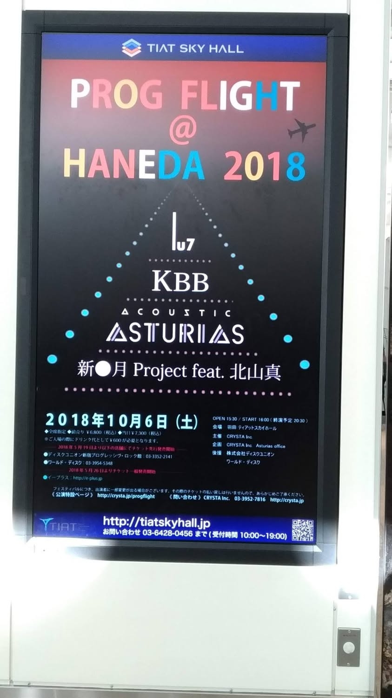

去年に引き続いて開催された羽田空港でのPROG FLIGHTイベント。
Acoustic Asturias, Lu7, 新●月Project feat.北山真, KBBの順番で、プログレ三昧。
どれも楽しかったのですけど、北山さん入りの新月が神がかっていて凄かった。
北山さん抜きの新●月Projectも何度か観ているのですが、この方がそこに居るだけで全然空気が違っていて。いやぁ凄いもの観れたなぁ。

### Acoustic Asturias

- 川越好博 (piano)
- 筒井香織 (clarinet, recorder)
- テイセナ (violin)
- 西村健 (guitar)

### Lu7

- 梅垣ルナ (keyboards)
- 栗原務 (guitars)
- 岡田治郎 (bass)
- 嶋村一徳 (drums)

### 新●月Project feat. 北山真

- 花本彰 (keyboards)
- 津田治彦 (guitars)
- 荻原和音 (flugelhorn)
- 直江実樹 (shortwave radio)
- 石畠弘 (bass)
- 谷本朋翼 (drums)
- 小澤亜子 (percussion)
- 北山真 (vocals)

### KBB

- 壷井彰久 (violin)
- 高橋利光 (keyboards)
- Dani (bass)
- 菅野詩郎 (drums)

