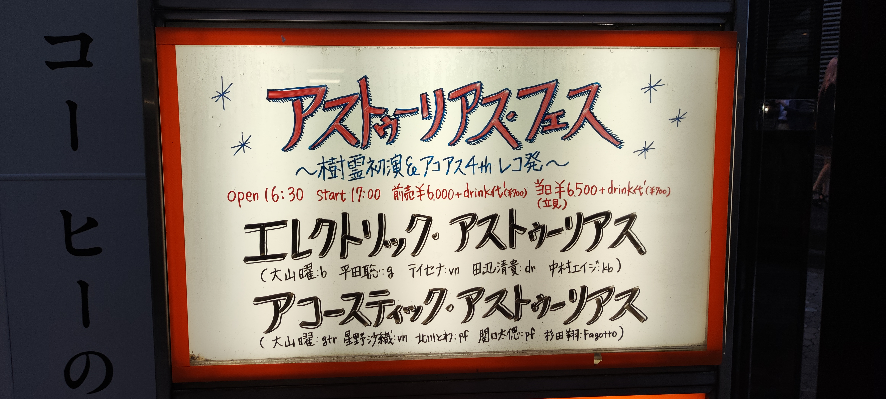

アストゥーリアスフェスday2、アコアスではファゴット入りのアドレセンシアが凄くハマっていました。エレアスも昨日よりさらに良かったな。
総勢9名で演奏された樹霊パート2は、今までの集大成といった感じて。
迂闊にまた見たいとは言いづらいけど、ほんとに良かったです。

### Acoustic Asturias

1. Heliocentrism
2. 深夜廻
3. Midsommarstang
4. Snowy Landscape（北川とわ）
5. アドレセンスィア
6. Rythmus（星野沙織）
7. Ricochet
8. 我々はどこから来たのか 我々は何者か 我々はどこへ行くのか？

- 大山曜 (gut guitar)
- 北川とわ (piano)
- 関口太偲 (piano)
- 星野沙織 (violin)
- 杉田翔 (fagotto)

### Electric Asturias

1. Deadlock Triangle
2. Stone Circle
3. クロウ
4. （新曲）
5. ステンノー
6. Fourth Dimention Part 4

- 大山曜 (bass)
- 平田聡 (guitars)
- テイセナ (violin)
- 田辺清貴 (drums)
- 中村エイジ (keyboards)

### Asturias

1. 樹霊 Part 2
2. The Lancer (encore)

