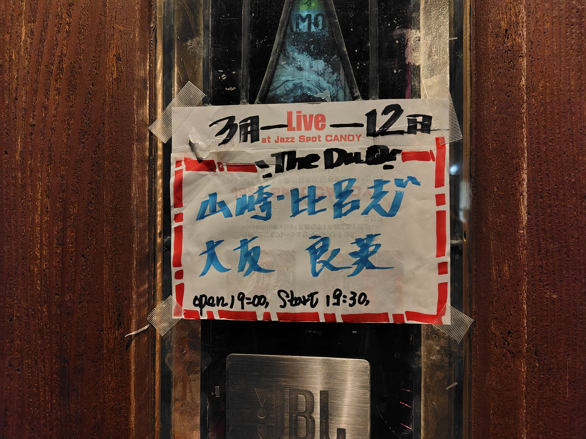
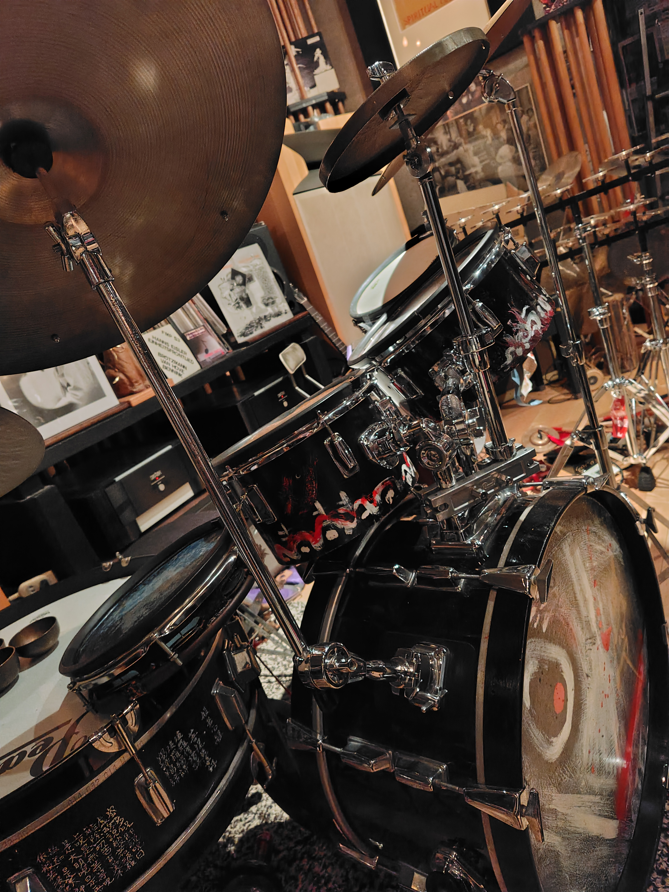

大友良英さんのライブが最寄りのジャズ喫茶CANDYで行なわれるということで行ってきました。大友さんのライブを観るのは結構久々で、PIT-INNの配信とかは観てたけど、生で観るのは10年ぶりくらいかも。

この日はジャズドラマーの山崎比呂志さんとのデュオ、山崎さんに関してはよく知らなかったのですが大友さんの師匠でもある高柳昌行とずっと一緒に演奏されていた方だそうで、御年85歳。

70年代当時の頃の演奏は聴いたこと無いのですが終始緊張感のある演奏で、大友さんもこの日はパーカッション6割ギター4割くらいの割合でしたが、シンバルの連打にノイジーなギターが絡んでくるのはただただ格好良い。

会場で1973年の「NEW DIRECTION FOR THE ARTS」という当時の演奏のCDを買ったので後で聴いてみます。

- 大友良英 (guitars, percussions)
- 山崎比呂志 (drums, percussions)

