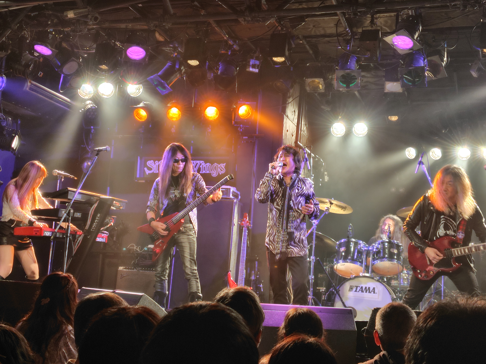
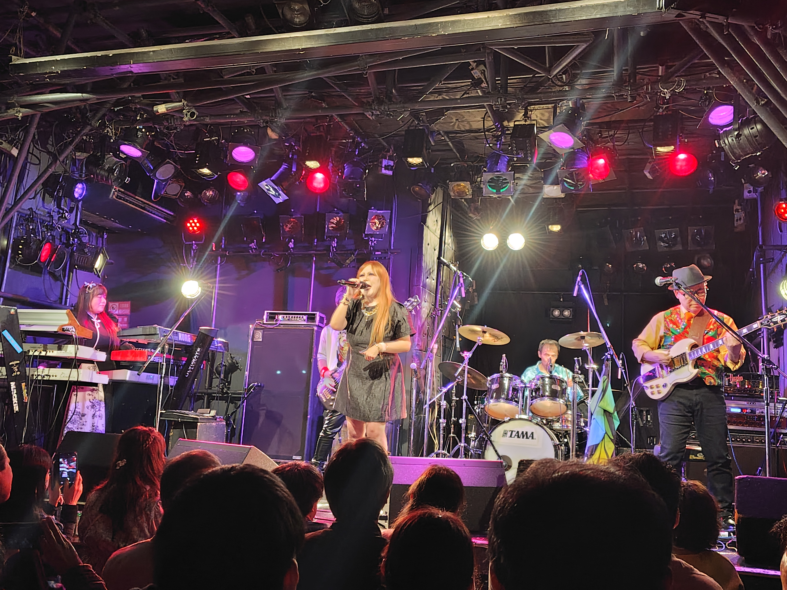
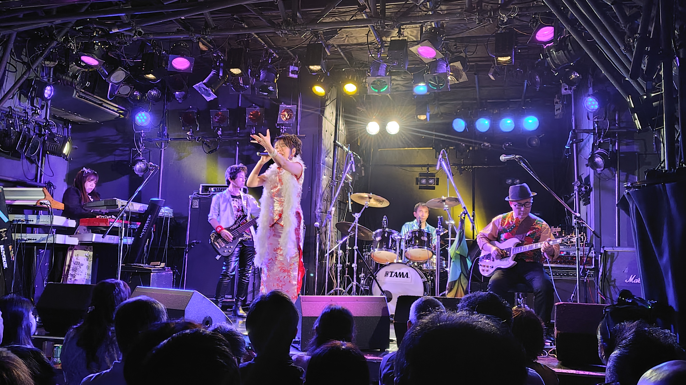
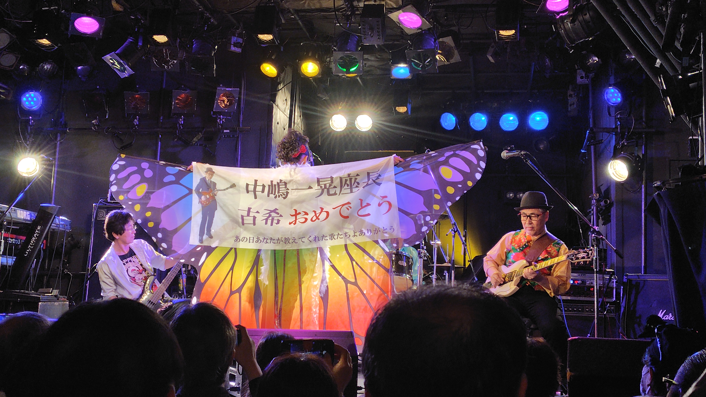
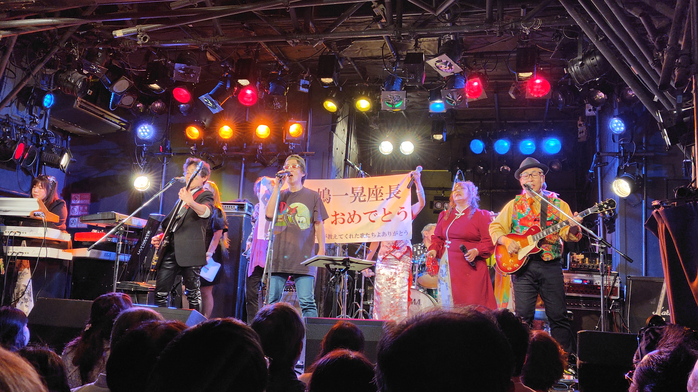
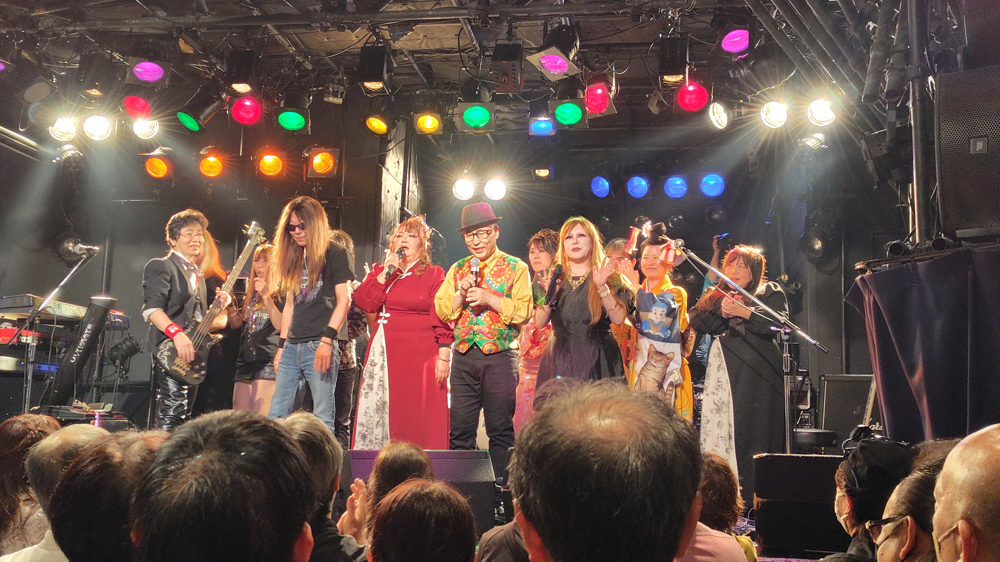

浪漫座「レコ初＆座長古希祝い」のライブを観に吉祥寺ROCK JOINT GBに行ってきました。
前回の2023年の夏でもここでしたが、その後中嶋一晃さんのご病気が発覚したのですが・・・それでも新譜を出してまたココでまた観ることができて本当に良かった。

### Silver Wings

最初は元シェラザード、スターレスの大久保寿太郎さんのSilver Wingsボーカルは元ソフィアの森川健司さん。 シェラザードやスターレスの楽曲（最後にソフィアの曲も）など。魅惑劇も良かったけど「悪魔が泳ぐ夢の国へ」を聴けて嬉しかったなー格好良い。
久々に観た堀江仙人はますます神に近づいておりました。なんかAcid Mothers Templeの川端さんにも似てるような。

1. Don't Stop
2. 予感
3. ？
4. 魅惑劇
5. 悪魔が泳ぐ夢の国
6. Lacher

- 大久保寿太郎 (bass)
- 森川健司 (vocals)
- 堀江睦男 (drums)
- 遠藤コースケ (guitars)
- 山内めぐみ (keyboards)

### デキゴコロ

恒例の(?)中之島花子さんとのミニコントを挟んで、廣田直子さんボーカルのデキゴコロ。座長は体力があれで基本座っての演奏（Frippのマネでは無いですよと）泉谷さんのドラムも良き。
デキゴコロでもアルバム作らないかなー。

1. 金色絡繰異聞
2. 爪痕
3. ハーレムダンス
4. 赤く塗れ

- 中嶋一晃 (guitar)
- 廣田直子 (vocals)
- 前田里知 (keyboards)
- 浜田勝徳 (bass)
- 泉谷賢 (drums)

### 浪漫座別館

デキゴコロ終了後に1曲だけひなさん登場で浪漫座別館の「罪深き蝶々」を演奏。嬉しかったなー。

1. 罪深き蝶々

- 中嶋一晃 (guitar)
- ひな (vocals)
- 前田里知 (keyboards)
- 浜田勝徳 (bass)
- 泉谷賢 (drums)

### 浪漫座

そして最後はもちろん新譜をリリースした浪漫座の出番。無限階段のSEから「百鬼夜行」月本美香さん気合入ってて良かったなー。
基本的にはアルバムの曲順通りでの演奏。「死と再生の物語」は26年前に中嶋座長を初めて観た初期浪漫座のライブで演奏していて、当時とても気に入っていたのですがその後あまり演奏される機会はなく・・・またこの曲を聴けて本当に良かった。

1. 無限階段
2. 百鬼夜行
3. 時空の海
4. 綺麗な人たち
5. 遠い約束
6. 悪魔のワルツ
7. 死と再生の物語
8. 輪廻の宇宙
9. ヴェクサシオン
10. セルロイドの空 (アンコール)
11. 人形地獄 (アンコール)

- 中嶋一晃 (guitar)
- 月本美香 (vocals)
- 前田里知 (keyboards)
- 千秋久子 (flute)
- 浜田勝徳 (bass)
- 村中暁生 (drums)

アンコールでは中嶋秀行さん（別館の頃は良く参加されてたかと）も一緒に最後はやっぱり「セルロイドの空」何度聴いてもあの最後のギターの所はグッとくる。最後は全員で「人形地獄」
いやー本当に良いライブをありがとうございました。改めて写真見るとシュールな見た目のバンドだよなぁ…写真撮りそこねたけど、キーボードの前田さんがベースの浜田さんのネクタイ直しているのが非常に尊くて良かった。
中嶋座長古希おめでとうございます。これからも死ぬ死ぬ詐欺を続けて遺作をリリースし続けて頂ければ。

なんと11月にシルバーエレファントのライブの予定があるそうで。また行きたいと思っています。

