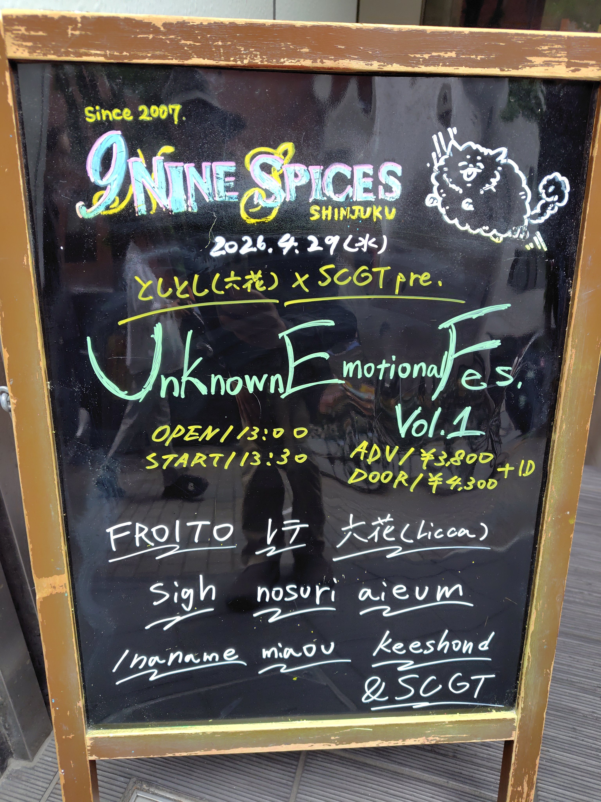
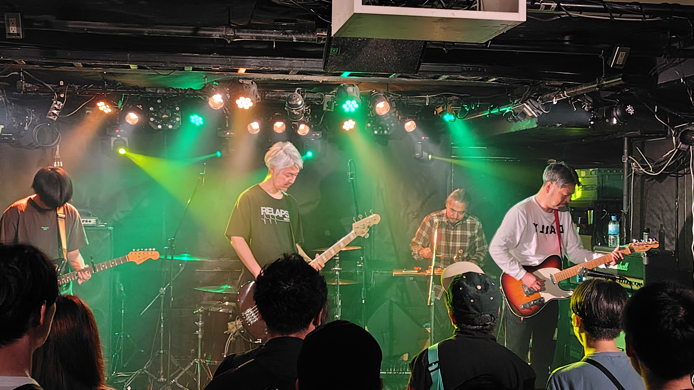
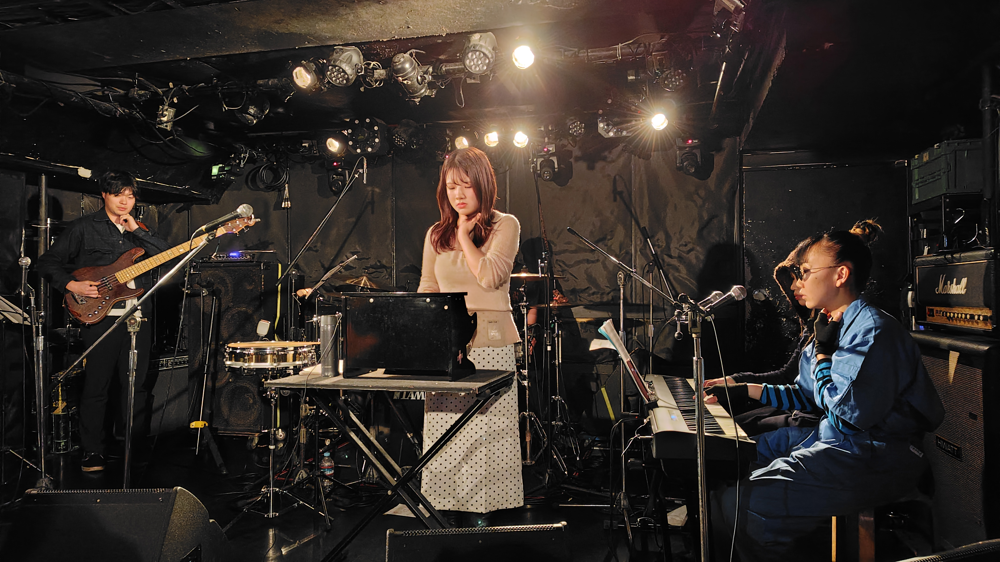
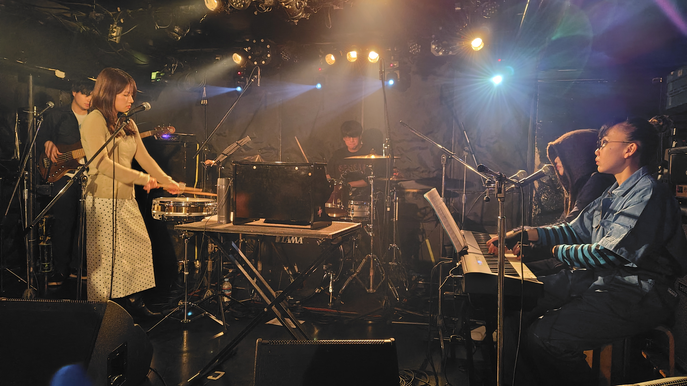
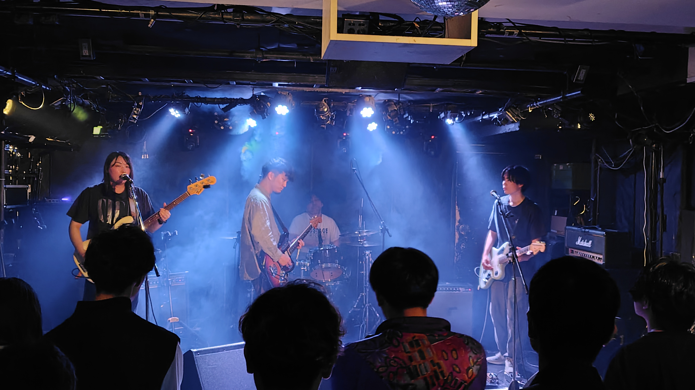
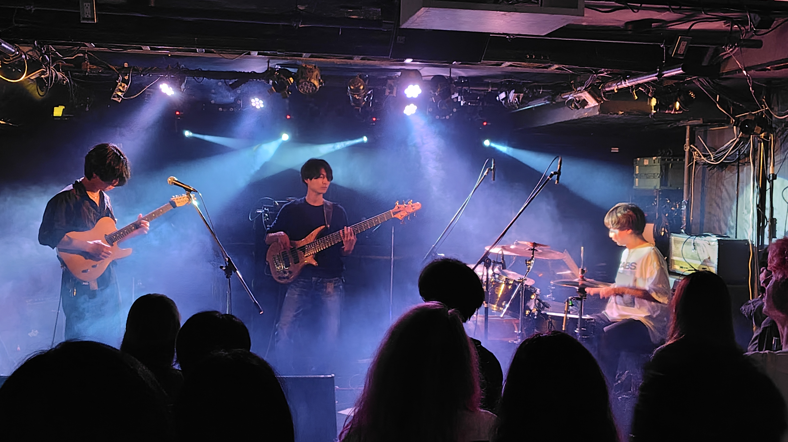
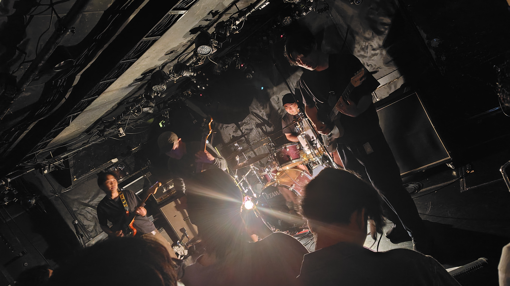

「Unknown Emotional Fes. vol.1」という関東以外のマスロック・ポストロックみたいな10バンド集めたイベント。
名古屋の「レテ」というバンドが初めて関東に来るということで行ってきました。全部初見だったのですが、どれも面白くて（すいません最後の2バンド見れなかった）

### FROITO

たしか結構以前から活動しているバンド（名前はあちこちで聴いた覚えが）ちょっと変態ぽいところもあるインストバンド、結構好きかも。
なんかトライアングルとシェイカー専属の変なメンバーが効いてる・・・と思ったら元BOaT/MUSIC FROM THE MARSの坂井キヨオシさんでした。

- Shimizu Goro (guitars)
- Haraken (guitars)
- Koichiro Nishiwaki (bass)
- Hamamoto Mariko (drums)
- Sakai Kiyooshi (percussions)

https://froito.com/

### レテ

名古屋のレテというバンド。今日はこれがお目当てで来ました。

最初メンバー全員が何か首筋に手を当てて演奏してると思ったら、個人個人の脈拍でリズム取ってフェーズシフティングみたいなことしてるのね。
ピアノの方の一人でライヒみたいな感じとか、最後の曲はいわゆる十二音技法の逆行形かな？なんかこう実験的なことやってるにも関わらず、歌い出すと急にポップな感じになって（それにしてもあの所々半音ずらしたようなメロディーは歌いづらそうだけど）実験的な所とポップな所の距離感がヤバいまま共存してる感じが面白いです。
セットリストは配布された「レテ通信」から。また来たら是非行こう。

1. 習作v
2. 習作i
3. 閉じない
4. 習作iii
5. 忘れて
6. 習作i (既反転)

- ホノカ (vocals, percussion)
- 西山 (piano, chorus)
- きりん (keyboards, clarinet)
- ふみや (bass)
- こじま (drums)

https://lit.link/letheJP

### sigh

新潟のバンド。今日の中では割と普通なロックバンドかな。ベースボーカルの声が良い。

https://www.instagram.com/sigh_niigata/

### Licca(六花)

変拍子多めのマスロック。でも変態成分低めで割と聴きやすい。

https://liccaband.wixsite.com/licca

### nosuri

ギター + 6弦ベース + ドラム。今日一番テクニカルだったかも。Liccaもそうだけど複雑なフレーズ演奏しててもスマートに聴こえる。

https://lit.link/nosuriinst

### aieum

沖縄のバンドみたい。ちょっとポストロック寄りのインストバンド（今日だいたいインストだけど）
ちょっとドラマチックな感じの曲が良かったです。

https://www.instagram.com/aieum_info

### /naname

名古屋のマスロック、どの曲もギターのミニマルフレーズで「スン」って終わるのが面白い。
ツインギターの絡みがとても良くて、結構考えられて作ってそう。ベースの音が良き。

https://www.instagram.com/naname_nagoya.jp

### miaou

急にポップなインストバンド。音源自体は配信で聴いてたのですが、ライブだと結構音圧高めなのね。気持ち良い。

- 浜崎龍樹 (guitars)
- 長谷川真弓 (bass, synthesizer)
- 長谷川宏美 (drums)

https://miaoumusic.com/
