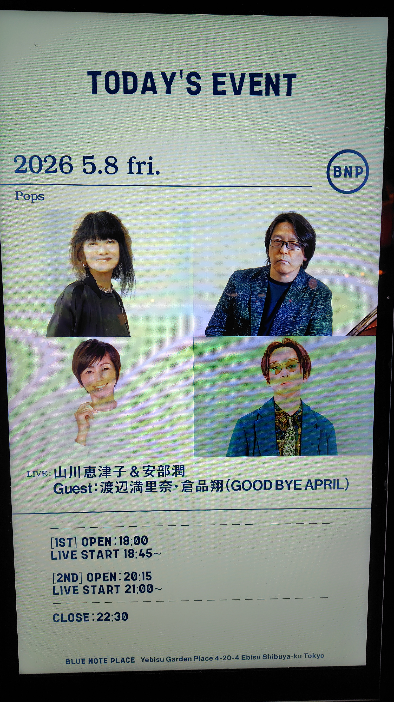

山川恵津子さん時代の渡辺満里奈さんの曲が聴けそうな滅多に無い機会なので恵比寿BLUE NOTE PLACEへ行ってきました。入れ替えありの2nd setの方。

最初に2曲ほどフュージョンぽい演奏を。バンドのメンツがプロのスタジオミュージシャンすぎで…マライア/ナスカのギターの土方さんも初めて観ました。江口信夫さんなんかは当時の渡辺満里奈のアルバムでもドラム叩いてるんだよな。
山川さんと一緒にこの日の主催者の阿部潤さんは現カシオペア（大髙清美さんの後任）なのですね。

倉品翔さんが東北新幹線（山川恵津子さんの昔のユニット）の「月によりそって」という曲（凄い良い曲、アルバムの中で一番好き）を。まさか東北新幹線の曲まで聴けるとは思わなかった。

入れ替わりで渡辺満里奈さん登場。生で拝見するのはえーと・・・35年ぶりくらいかも。何かこう物凄く不思議な感情が。小学生の頃に日曜夜ニッポン放送の渡辺満里奈のラジオを毎週聞いてたのを思い出しました。
満里奈さんの曲は3曲。いやもう本当に今更山川恵津子をバックに歌う渡辺満里奈の歌唱を聴くことができるなんて。あーでも「ホワイトラビットからのメッセージ」も聴きたかったなぁ。

最後はもう一度倉品さんも出てきて「夢で逢えたら」を全員で。あの中間のセリフは山川さんが。いやしかし山川さんの声かわいいな。

まぁそんなわけで念願かなって渡辺満里奈さんのアイドルポップスを聴くことができました。ありがたや。

1. ??? (Incognito)
2. KIMONO (櫻井哲夫)
3. Tokyo Weekend Magic (倉品翔/Good Bye April)
4. 月に寄りそって (倉品翔/東北新幹線)
5. ??? (倉品翔)
6. Catch Me Tonight (渡辺満里奈)
7. 見つめてあげたい (渡辺満里奈)
8. マリーナの夏 (渡辺満里奈)
9. 夢で逢えたら

- 山川恵津子 (keyboards, vocals)
- 阿部潤 (keyboards)
- 江口信夫 (drums)
- 土方隆行 (guitars)
- 川崎哲平 (bass)
- 森下歩哉 (sax, flute)
- 渡辺満里奈 (vocals)
- 倉品翔 (vocals)

