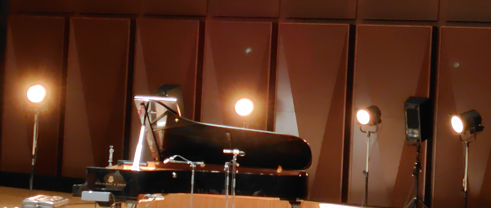

2016年に（本当はNana Vasconcelosと来るはずだった）から10年ぶりとなるジスモンチの来日公演。私は10年前は行ってないので、13年前に息子さんと共演した渋谷シアターオーブ以来のジスモンチとなります。
ダニエルムハイは若手のギタリスト？ジスモンチ曲を演奏したアルバムもリリースしているみたいです（会場で買った）

前半はジスモンチのピアノでの演奏から「おぉInfanciaから・・・」と思ってたら中間部にいろんな曲のフレーズを詰め込んだ演奏（Maracatuとか7aneisとか入ってたかな）
次はブラジルの素晴らしい作曲家の曲がどうこうと言って、ジョビン（白と黒のポートレイト）、ピシンギーニャ、ヴィラロボスの曲を1曲ずつ。

ここでDaniel Murrayが登場してジスモンチの10弦ギターとムハイのギターによる演奏。曲目ちょっと分からないけど、最初のピアノソロみたいに何曲か繋げてやってました。
一旦ジスモンチが引っ込んでムハイのソロで「Agua & Vinho」を演奏。さっきまではジスモンチのサポート的な演奏で分かりづらかったのですが、やっぱりこの人の演奏も雰囲気があって凄い。
今度はチューニングするとのことでムハイが引っ込んでジスモンチのピアノでCharlie HadenのSilence（共演アルバムのMagicoに入ってるやつ）を演奏、個人的にはコレが今日イチぐっと来た。

最後にジスモンチがギターを置いて（なんか絶妙に落っこちそうな所に置くからハラハラした）ジスモンチのピアノとムハイのギターで「Frevo」を…ピアノ凄い速さでギター入りづらそうだったけどアレで良かったのかな？

客電付きかけてから更にアンコールに応えてくれてジスモンチのピアノソロ、コレも最初と同じ用に色んなフレーズが入ってたのですが、ここで「Palhaco」のフレーズ聴けて嬉しかったな。

