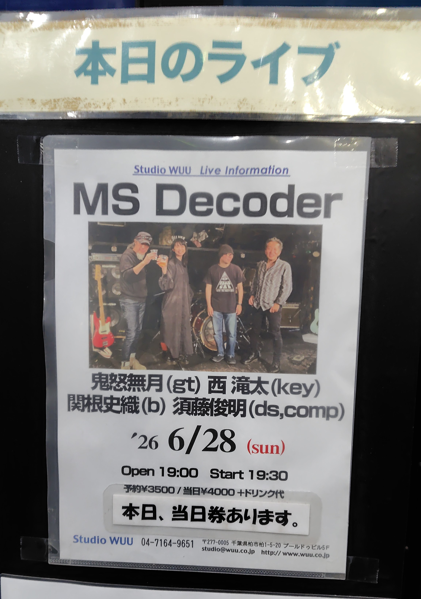

昼のzabadakからそのまま鬼怒無月さんを追っかけて柏のStudio WUUでMS Decoder。
演奏曲は相変わらずもmobile suiteの曲を1から順番に、前半が1-8で後半が9-15という感じ（途中インプロもあったかな）須藤俊明さんのMay Album ( https://sudohtoshiaki.bandcamp.com/album/may-album ) の曲とかやってもいいのにな。
生で観戦するのは久々でしたがバンド感が更に増してきた？感じ。関根さんの「ドゥーン」ってベースが良いわぁ。

会場で西滝太さんのピアノソロアルバム https://ryotanishi.bandcamp.com/album/syo-kou を買ったのですが、すごい良いアルバムでびっくりした。表題曲がAndres Beeuwsaertとかみたいな叙情的な感じで。

- 須藤俊明 (drums)
- 鬼怒無月 (guitar)
- 西滝太 (piano, keyboards)
- 関根史織 (bass)

