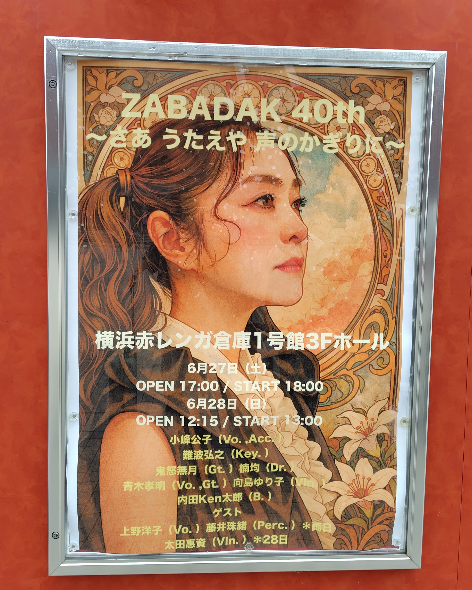
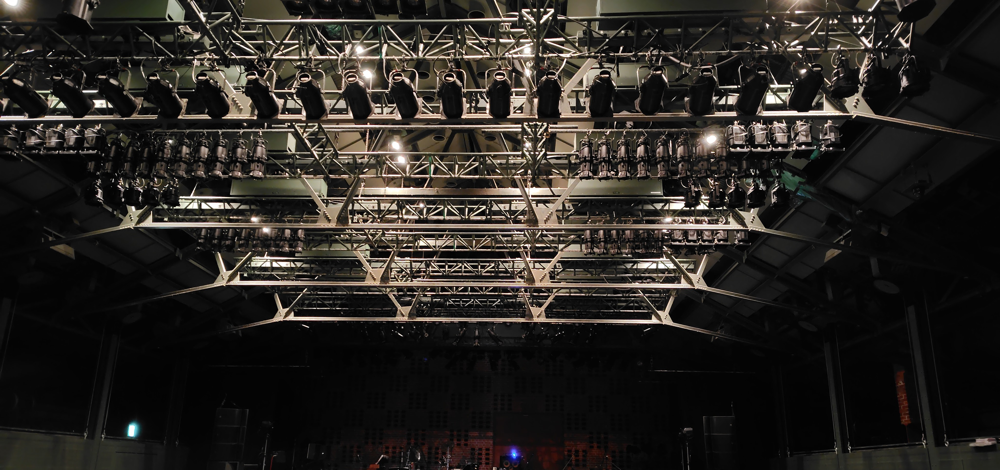

ZABADAKの40thライブの2日目、追加公演。
「ゲスト：上野洋子」とのことで告知出た際にはちょっとビックリしたのですが、ファンクラブ先行とかもあってチケット争奪戦になりそうだし。それに吉良さんが亡くなってからしばらくZABADAKから離れていた（配信ライブとかは見てたけど）ので、少し申し訳ない気持ちもあり初日の方はスルーしてたのです。わりと直前になって追加公演の情報を知り、やっぱり観ておかないと後悔するかなと思いチケット申込を。
前半は通常メンバーで、やっぱりこのフル編成だとプログレ度が高め（難波先生もいるし）内田KEN太郎さんのフレットレスベースが独特な感じで、自分も見たこと無いですが超初期のZABADAKの雰囲気をプラスしているような。鏡の森とか良かったなぁ。
Poland終わって上野洋子さん登場「天使に近い夢」「二月の丘」を。仙波清彦や新月などのゲストボーカルなどで何度か見ていますが、ZABADAKの曲を歌うのは本当に1993年以来で。特に「Walking Tour」では小峰さん向島さん藤井さんの4人でのコーラスが素晴らしかったです。

上野さんは一旦引っ込んで、青木孝明さんの歌う「Wonderful Life」の演奏後、鬼怒無月さんはW柏でMS Decoder（行ってきました）があるため退場。代わりにバイオリン太田惠資が参加。向島さん太田さんのツインバイオリンという豪華な編成に。
ラストの「DIER PAIDIR - ブリザードミュージック - Easy Going」の流れは本当に力強く、バンドならではの音だなーと思いいました。もうこの編成で10年近くやってるんですね。

アンコールでは「永遠の森」これもCD聞いた時はあまり印象に残ってなかったけど凄い良い曲だな。再び上野さんも登場して「五つの橋」「遠い音楽」ココに居るお客さんみんな思ってるけどまさか上野さんと小峰さん一緒に歌うこの曲が聴ける日がくるとは。

個人的な話、最初にZABADAKを知ったのは確かテレビ神奈川でharvest rainのPVを見た時でたぶん1990年。上野さん在籍時のライブは恐らく93年の中野サンプラザとnoren-wakeの2回、その後たまに行ってはいたのですが段々ライブには行かなくなり、2013年の「夏秋冬春」を聴いて「やっぱり良いなぁ」などと思いまた頻度は少ないのですがまた観に行くようになったのですが、2016年に吉良さんが亡くなられて。
吉良さんがいなくなってから生で見るのは初だったのですが小峰さんは勿論、周りのメンバー（改めて見ても凄いメンバーだよな）がZABADAKの音楽を続けていこうというような気持ちの伝わってきたようにちょっと思いました。

1.  Birthday
2.  風の巨人
3.  今日の夢のこと
4.  いのちの記憶
5.  小さい宇宙
6.  鏡の森
7.  旅の途中
8.  Poland
9.  天使に近い夢
10. 二月の丘
11. Walking Tour
12. Wonderful Life
13. Dier Paidir
14. Blizard Music
15. Easy Going
16. 永遠の森 (encore1)
17. 五つの橋 (encore1)
18. 遠い音楽 (encore1)
19. 相馬二編返し (encore2)

- 小峰公子 (vocals, accordion)
- 難波弘之 (keyboards)
- 向島ゆり子 (violin)
- 青木孝明 (guitars, vocals)
- 内田Ken太郎 (bass)
- 楠均 (drums)
- 藤井珠緒 (percussions)
- 鬼怒無月 (guitars on 1-12.)
- 太田惠資 (violin on 13-18.)
- 上野洋子 (vocals on 9-11, 17, 18)

