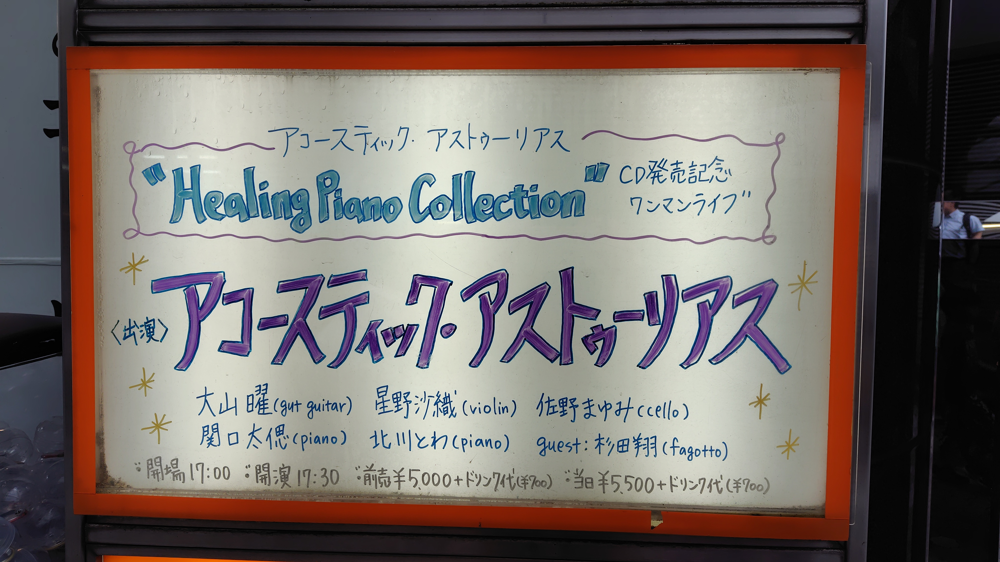

AsturiasのYoutubeチャンネルで随分前から配信している「Healing Piano Collection」をまとめたアルバムの発売記念ライブ。
こちらのアルバムだと基本ピアノ＋1名(violin,cello,fagotto)という編成ですが、ライブではいつも通り大山さんのギターも入ったAcoustic Asturiasでの演奏。
メンバーは曲によって凄い入れ替わるのでセトリの方に記載。大山さんと星野さんは基本出ずっぱりで後半1曲目だけ男子3名での演奏。
「id」は星野沙織さんがISAOさんとのsoLiというユニットの曲、この編成での演奏でも元がなんか激しそうなのはなんとなく分かる。
「Nothing Lasts Forever Part1」は大山さん新曲、ダイナミックで展開のある流石のプログレらしい曲。ちょっと麻痺しつつあるけど、このアコースティック編成でこんなプログレっぽいのは珍しいような。
「MERAKI」は2piano Asturias企画の際にファゴットの杉田さんが作ってきたという曲、展開多めの室内楽寄りな感じで。今の編成になってから北川さん星野さんの曲も演奏していますが、そことも少し毛色が違う感じでとても良かったです。新譜に入るかな？

ちなみにアルバムは[YouTubeで配信してる](https://www.youtube.com/playlist?list=PLOGH-Vtgcx6SJ6bmXEhEcTtCStvNGZoOB)の結構曲数あったよな、と思っていたらきっちり15曲でCD収録時間ギリギリまで入ってました。凄え。

今後は2piano Asutriasのライブとエレアスのレコ初が決まっているようで、曲がたまり次第アコアスの新譜も作りたいとのことで。もうアコアスで再開してから20年以上になりますがコンスタントに活動しているのは地味に凄いなぁ。

### 1st set

1. 深夜廻 (関口/星野/佐野)
2. Yuragi (北川曲, 北川/星野/佐野)
3. Mirror World (北川/星野/佐野)
4. Adolescencia (関口/星野/杉田)
5. Midsommerstång (関口/星野/杉田)
6. id (星野曲, 北川/星野/佐野)
7. Snowy Landscape (北川曲, 北川/星野/佐野)
8. Global Network (北川/星野/佐野)

### 2nd set

9. sky brial 鳥葬 (関口/杉田)
10. Nothing Lasts Forever Part1 (関口/星野/佐野)
11. Ritmus (星野曲 関口/星野/佐野)
12. カレワラ (北川/星野/佐野)
13. MERAKI (杉田曲, 関口/星野/佐野/杉田)
14. The Lancer (関口/星野/佐野/杉田)
15. 我々はどこから来たのか 我々は何者か 我々はどこへ行くのか？ (関口/星野/佐野/杉田)
16. Cryptogam Illusion (encore,北川/星野/佐野)

- 大山曜 (gut guitar)
- 星野沙織 (violin)
- 北川とわ (piano)
- 佐野まゆみ (cello)
- 関口太偲 (piano)
- 杉田翔 (fagotto)

